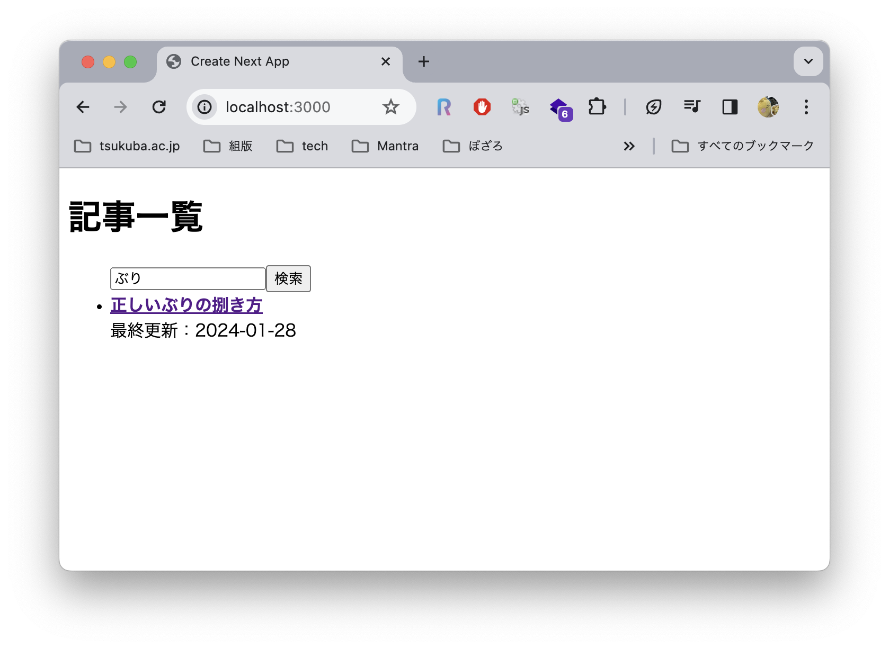

# 3. コンポーネント

## 目標

コンポーネントと、React Hooks やイベントハンドラを扱います。
また、サーバ／クライアントコンポーネントの違いを理解します。

## コンポーネントの分割

React の特徴であるコンポーネントに触れてみます。
あるまとまった機能をコンポーネントとして切り出すことで、ソースコードの肥大化を防いだり、多人数での開発を簡便化したりすることができます。

### コンポーネントの定義

`/src/components` ディレクトリを新たに作成し、直下に `ListItem.js` を作成します。ファイルには*リスト 4* を記述します。

ListItem が受け取る引数は props と呼ばれ、コンポーネント間で情報を受け渡す際に使用されます。
コンポーネントを呼び出す際には、属性として値を渡します。

```jsx
import Link from "next/link";

const ListItem = ({ id, title, date }) => {
  return (
    <li>
      <div>
        <Link href={`/articles/${id}`}>
          <b>{title}</b>
        </Link>
      </div>
      <div>{date && `最終更新：${date}`}</div>
    </li>
  );
};

export default ListItem;
```

*リスト 5：ListItem.js*

備考

- コンポーネントは `/src/components` 以下に配置する場合が多いですが、App Router の導入によってその必要性は薄れつつあります。
- サンプルのように、[分割代入](https://developer.mozilla.org/ja/docs/Web/JavaScript/Reference/Operators/Destructuring_assignment)を使用すると `props.id` のように記述する必要がなくなり便利です。


### コンポーネントの呼び出し

`ListItem.js` を `/src/app/page.js` から呼び出します。
next/link は Home コンポーネントでは最早使用していないため、import から削除します。

`page.js` の変更後のコードを*リスト 5* に示します。

```jsx
import ListItem from "@/components/ListItem";

const Home = async () => {
  // 省略

  return (
    <main>
      <h1>記事一覧</h1>
      <ul>
        {json.map((item) => (
          <ListItem
            id={item.id}
            title={item.title}
            date={item.date}
            key={item.id}
          />
        ))}
      </ul>
    </main>
  );
};

export default Home;
```

*リスト 6：page.js*

備考

- create-next-app の標準設定で `@/` は `/src/` に対応するように設定されているため、`@/components/...` は `/src/components/...` を指します。

### まとめ

一連の変更により、「リンク先の内容を表示する」部品を ListItem コンポーネントとして切り出すことができました。

この例ではコンポーネントのサイズが小さいため、分割する必要はあまり感じないかもしれません。しかしながら、アプリケーションの規模が大きくなり、より複雑な UI やロジックを有するようになった場合は、適切なサイズでコンポーネントに分割していくことで、その恩恵を享受することができます。

## 検索機能の実装

簡単な検索機能を実装してみます。テキストボックスを設け、キーワードが入力された際にはマッチする記事のみを表示するように変更します。

### サーバコンポーネント、クライアントコンポーネント

Next.js 13 / React 18 から登場した概念に [React Server Components](https://nextjs.org/docs/app/building-your-application/rendering/server-components)（RSC）が存在します。RSC はサーバサイドで実行され、対照となる概念のクライアントコンポーネント（CC）はクライアントサイドで実行されます。
最近の Next.js で標準的に使用される App Router と呼ばれる機構では、明示的に指定しない限りコンポーネントは RSC として処理されます。
RSC 内に CC を記述することはできますが、CC 内に RSC を記述することはできません。

基本的には RSC に寄せていく方針で間違いありませんが、次に代表される要件を含む場合は、RSC では制限が掛かるため CC として指定する必要があります。

- ユーザの動作（クリック等）に合わせて（ページ遷移以外の）インタラクションを起こす
- CSS では表現できない、動的な表現を加える

### 検索ボックスを作る

今回の「テキストボックスに入力されたキーワードにマッチする記事のみを抽出する」といった処理も、CC で表現すべき内容であると考えます（厳密には RSC でも表現可能ではありますが）。ただし、fetch の部分は RSC として実行したいため、以下の構成を採用します。

| ファイルパス | RSC or CC、備考 |
| --- | --- |
| `/src/app/page.js` | RSC、Form.js を呼び出す |
| `/src/components/Form.js` | CC、ListItem.js を呼び出す |
| `/src/components/ListItem.js` | CC |

そのコンポーネント**以下**が CC であると宣言するには、冒頭に [use client ディレクティブ](https://ja.react.dev/reference/react/use-client)（`"use client";`）を記述します。CC の子孫コンポーネントは自動で CC として認識されるため、RSC と CC の境界である Form.js にのみ use client ディレクティブを記述すれば OK です。

`Form.js` には*リスト 6* の内容を記載します。

```jsx
"use client";

import { useState } from "react";
import ListItem from "./ListItem";

const Form = ({ items }) => {
  // キーワードを保管
  const [keyword, setKeyword] = useState("");
  // フィルタリング結果を保管
  const [filteredItems, setFilteredItems] = useState(items);

  // 検索を実行
  const search = (e) => {
    e.preventDefault();
    setFilteredItems(
      keyword.length > 0
        ? items.filter((item) => item.title.includes(keyword))
        : items
    );
  };

  return (
    <>
      <form onSubmit={search}>
        <input
          type="text"
          placeholder="キーワードを入力"
          value={keyword}
          onChange={(e) => setKeyword(e.currentTarget.value)}
        />
        <input type="submit" value="検索" />
      </form>
      {filteredItems.map((item) => (
        <ListItem
          id={item.id}
          title={item.title}
          date={item.date}
          key={index}
        />
      ))}
    </>
  );
};

export default Form;
```

*リスト 7：Form.js*

備考

- fetch を RSC で実行すると Next.js 側で[キャッシュ](https://nextjs.org/docs/app/building-your-application/caching)されるため、パフォーマンスの改善や重複した API 呼び出しの排除が期待されます。
- fetch を CC で実行する場合は、[useEffect](https://ja.react.dev/reference/react/useEffect) 等の Hooks を用いて過剰な呼び出しを抑制する必要があります。
- ListItem 要素に与える key を `item.id` から `index` に変更しています。フィルタリングを実行した際に、id を指定すると表示が重複するバグが生ずることが要因です。

### useState

*リスト 6* で特筆すべきは [`useState`](https://ja.react.dev/reference/react/useState) です。これは [React Hooks](https://ja.react.dev/reference/react/hooks) と呼ばれる仕組みに則って、コンポーネント内の状態を管理するために使用します。

冒頭で述べたように、React は宣言的 UI を採用するため、状態を管理するには通常の変数（`let foo = "bar"`）などではなく、useState 等の専用の関数を使用する必要があります。こうした React の便利機能を関数として押し込めたものを React Hooks と呼びます。

useState は戻り値として、状態の値と、状態を更新するための関数を返します。これらは分割代入を用いて `[foo, setFoo]` といった命名で使用することが多いです。useState の使用例を以下に示します。（このコードを追記したり、実行したりする必要はありません）

```jsx
// count の初期値に 0 をセット
const [count, setCount] = useState(0)

// setCount で値をセット
// prev には現在の値（初期状態では 0）が入る
// prev に 1 を足した値をセットするので、更新後の値は 1 となる
setCount((prev) => prev + 1)
```

### イベントハンドラ

ボタンを押したり、テキストボックスに文字を入力したりすると[イベント](https://developer.mozilla.org/ja/docs/Learn/JavaScript/Building_blocks/Events)が発生します。
このイベントを補足する関数をイベントハンドラと呼びます。

React では、属性に onChange, onClick, onSubmit といったイベントを指定し、その値に関数（イベントハンドラ）を指定します。
イベントハンドラの記述例を以下に示します。

```jsx
// ボタンのクリック時にアラートを表示
<button onClick={() => alert("アラート")} />
```

*リスト 6* では、onSubmit イベントに search 関数を対応付けています。これにより、検索ボタンを押したり、エンターキーを押した場合に検索（フィルタリング）が実行されます。テキストボックスには `onChange={(e) => setKeyword(e.currentTarget.value)}` と記述を加え、変更後の値を keyword に保存しています。

また `page.js` を*リスト 7* の通りに書き換え、Form.js を呼び出すようにします。

```jsx
import Form from "@/components/Form";

const Home = async () => {
  const BASE_URL =
    "https://raw.githubusercontent.com/ZDK-UTsukuba/ipc-web-training-2024/master/phase3/samples/data";
  const url = `${BASE_URL}/index.json`;
  const response = await fetch(url);
  const json = await response.json();

  return (
    <main>
      <h1>記事一覧</h1>
      <ul>
        <Form items={json} />
      </ul>
    </main>
  );
};

export default Home;
```

*リスト 8：page.js*

備考
- イベントハンドラの記述には、コンポーネント内で定義した関数を渡すほかに、[無名関数](https://e-words.jp/w/%E7%84%A1%E5%90%8D%E9%96%A2%E6%95%B0.html)を利用することもできます。

### まとめ

一連の実装を通じて、記事一覧画面に簡易的な検索機能を追加することができました。大規模な検索機能や全文検索等を実装する場合は [Elasticsearch](https://www.elastic.co/jp/elasticsearch) 等の検索エンジンやライブラリを使用する必要がありますが、小規模（数千程度のオーダ）かつ、タイトルや短い説明文を対象とした検索を実施する場合は、フロントエンドでの絞り込みで十分に対応可能であると考えます。



