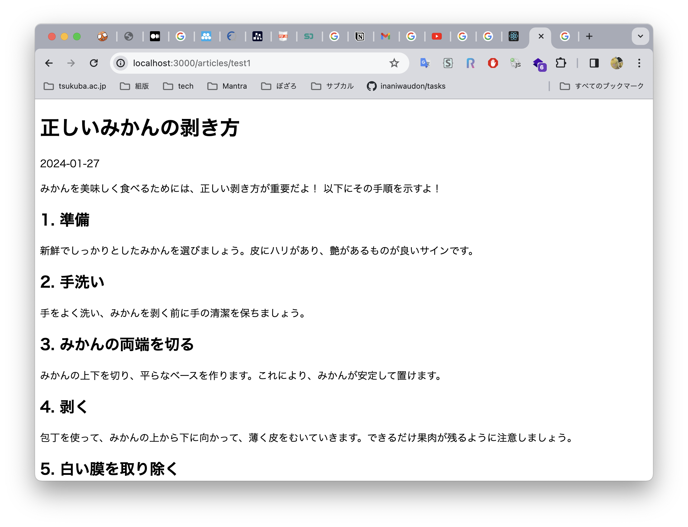

# 4. ルーティング

## 目標

Next.js の簡単なルーティングを理解します。

## 基本的なルーティング

以下の理屈により、http://localhost:3000 を開いた際には、`/src/app/page.js` が表示されています。

- `app` 以下（子孫ディレクトリも含む）に存在する `page.js` はページを表す
- `/src/app/page.js` は `/src/app` 直下に存在しているため、トップページに表示される

子孫ディレクトリに `page.js` を配置した際の規則は下記の通りです。

| ファイルパス | ルーティング |
| --- | --- |
| `app/foo/page.js` | /foo |
| `app/foo/bar/page.js` | /foo/bar で表示される |
| `app/foo/(bar)/baz/page.js` | /foo/baz で表示される（[Route Groups](https://nextjs.org/docs/app/building-your-application/routing/route-groups) 機能により半角括弧で括ったディレクトリはルーティングに加えない）
| `app/_foo/page.js` | なし（アンダースコア `_` から始まるディレクトリは無視される）

## 記事詳細画面の実装

記事の詳細画面を実装します。

### Dynamic Routes

多くのブログシステムでは、記事詳細画面のパスには `/articles/:id`（`:id` は任意の ID を取る）等が割り当てられています。Dynamic Routesは、こうした動的な値に対するルーティングを実現します。

`/src/app/articles/[id]` ディレクトリを作成し、直下に*リスト 9* を記述した `page.js` を作成します。

```jsx
import Link from "next/link";
import { ArticleContent } from "@/components/ArticleContent";

const Home = async ({ params }) => {
  // index.json を読み込む
  const BASE_URL =
    "https://raw.githubusercontent.com/ZDK-UTsukuba/ipc-web-training-2024/master/phase3/samples/data";
  const jsonUrl = `${BASE_URL}/index.json`;
  const jsonResponse = await fetch(jsonUrl);
  const json = await jsonResponse.json();
  const item = json.find((item) => item.id === params.id);

  // Markdown を読み込む
  const markdownUrl = `${BASE_URL}/articles/${item.id}.md`;
  const markdownResponse = await fetch(markdownUrl);
  const markdown = await markdownResponse.text();

  return (
    <main>
      <header>
        <h1>{item.title}</h1>
        <time>{item.date}</time>
      </header>
      <ArticleContent markdown={markdown} />
      <footer>
        <Link href="/">トップに戻る</Link>
      </footer>
    </main>
  );
};

export default Home;
```

*リスト 9：/src/app/articles/[id]/page.js*

### Markdown の表示

Markdown を表示するために、以下のコマンドを実行して [marked-react](https://www.npmjs.com/marked-react) パッケージをインストールします。

```bash
yarn add marked-react
```

`/src/components/ArticleContent.js` を作成し、*リスト 10* を記述します。marked-react は CC でのみ動作するため、冒頭に use client ディレクティブを付与します。

```jsx
"use client";

import Markdown from "marked-react";

export const ArticleContent = ({ markdown }) => {
  return (
    <article>
      <Markdown>{markdown}</Markdown>
    </article>
  );
};
```

### まとめ

一連の実装を通じて、記事詳細画面を追加することができました。


